# Firmware_Over_The_Air_RaspberryPi

This project is a firmware over the air for automotive industry using RaspberryPi 3B+ and STm32 Mc 

Till now we are using the full image of raspbian-buster

and also till now we manually put parser.py file and the desired code we want to flash to our st Mc

## The image for RaspberryPi
- you can download the Raspian Image from:
https://www.raspberrypi.org/downloads/raspbian/

- First unzip the the downloaded file using unzip command.
>unzip 2019-09-26-raspbian-buster.zip
- Then insert your SD card into your laptop, To discover the SD card
>lsblk -p   (this name should be /dev/mmcblk0 or /dev/sdX)
- Now time to Copy the unzipped image onto the mounted device using command dd.
>dd bs=4M if=raspbian.img of=/dev/sdX status=progress conv=fsync

## Enable Ethernet connection

To Configure a static IP for RPI3, Modify the file "/etc/network/interfaces" on your Raspbian image (or any Debian image):

Disable the DHCP client for eth0 interface by commenting this line using "#"
>iface eth0 inet dhcp    ====>   #iface eth0 inet dhcp

Add these lines after it to configure eth0 interface to use static IP:

>auto eth0\
>iface eth0 inet static\
>wait-delay 15\
>hostname $(hostname)\
>address 192.168.5.30\
>netmask 255.255.255.0

To enable ssh create an empty file named "ssh" in boot directory
>touch ssh

To enable password authentication, uncomment
>sudo nano /etc/ssh/sshd_config\
>#PasswordAuthentication yes   ====>   PasswordAuthentication yes

To connect with RaspberryPi:
>ssh-keygen -f "/home/$USER/.ssh/known_hosts" -R "192.168.5.30"\
>ssh pi@192.168.5.30 (defualt user: pi, default password: raspberry)

## Enable builtin WIFI
- enter this in terminal to configure wifi
>sudo raspi-config

- then select network

- then select WIFI

- then enter WiFi Name (SSID) and password, now you done with raspi-config.

- then enter this command
>sudo wpa_cli -i wlan0 reconfigure #it will reply with "OK"

## connect to RaspberryPi terminal over WIFI
add those lines to "/etc/network/interfaces"
>auto wlan0\
>iface wlan0 inet static\
>   wait-delay 30\
>   pre-up wpa_supplicant -B -Dwext -iwlan0 -c /etc/wpa_supplicant/wpa_supplicant.conf\
>   post-down killall -q wpa_supplicant\
>   address 192.168.1.30\
>   netmask 255.255.255.0\
>   gateway 192.168.1.1

## Configure UART on RaspberryPi 
>sudo raspi-config

- select -> interfacing options

- then, select serial option to enable UART

- then select No to login shell to be accessible over serial

- then select Yes to enable hardware serial port

- Now our UART is enabled for serial communication on Tx and Rx of RaspberryPi

- add "enable_uart=1" at the end of /boot/config.txt

In PC terminal
- to make sure it is connected and given a port name by the kernel use:
>dmesg  -wH  (ex.  /dev/ttyUSB0 )
- to change its permissions so you can read and write to it:
>sudo chmod o+rw /dev/ttyUSB0
- to test read from (ex. ttyUSB0):
>sudo cat /dev/ttyUSB0
- to test writing to (ex. ttyUSB0) :
>sudo echo "hello" > /dev/ttyUSB0

- connect your TTL(Tx) ==> RaspberryPi(Rx) and then TTL(Rx) ==>  RaspberryPi(Tx), pins (GPIO14 and GPIO15)
and cobbect TTL(GND) to RaspberryPi(GND)

In RaspberryPi terminal
- To check if mini UART (ttyS0) or PL011 UART (ttyAMA0) is mapped to UART pins, enter following commands:
>ls -l /dev
- to test reading from (ttyS0):
>cat /dev/ttyS0
- to test writing to (ttyS0):
>echo "hello" > /dev/ttyS0

You can check the references for further help on how they are created.

## Adding python3 lib
>sudo apt install python3-pyelftools

## google cloud
we are using google cloud to fetch the .elf from,\
sign in to google cloud using gmail account
then create a new project

and then create a new bucket inside this project.

**Adding google cloud sdk for Debian (from Raspberry by terminal):**

- Add the Cloud SDK distribution URI as a package source
>echo "deb [signed-by=/usr/share/keyrings/cloud.google.gpg] http://packages.cloud.google.com/apt cloud-sdk main" | sudo tee -a /etc/apt/sources.list.d/google-cloud-sdk.list

- Import the Google Cloud Platform public key
>curl https://packages.cloud.google.com/apt/doc/apt-key.gpg | sudo apt-key --keyring /usr/share/keyrings/cloud.google.gpg add 

- Update the package list and install the Cloud SDK
>sudo apt-get update && sudo apt-get install google-cloud-sdk

- initialize the connection with google cloud and select the project to work on.
> gcloud init       # you need to run this command @ (root user) to run elf_fetcher.sh at the boot

- to upload a file to google cloud (using Raspberry by terminal)

>gsutil -m cp -R [file name] gs://[Bucket name]/

- to download a file from google cloud (using Raspberry by terminal)

>gsutil -m cp -R gs://[Bucket name]/[file name] <directory to download the file in>

## PC GUI Application

- install python 3.8.1:
https://www.python.org/ftp/python/3.8.1/python-3.8.1-amd64.exe

- install pip from (windows CMD)
>python -m pip install --upgrade pip

- install pySide2
>pip install PySide2

- Adding google cloud compatible python library packages (Windows Cmd)
>pip install google-cloud-datastore\
>pip install google-cloud-storage

## What is the service accounts and keys in google clouds 
What are service accounts?
A service account is a special kind of account used by an application or a virtual machine (VM) instance, not a person. Applications use service accounts to make authorized API calls.
For example, a Compute Engine VM may run as a service account, and that account can be given permissions to access the resources it needs. This way the service account is the identity of the service, and the service account's permissions control which resources the service can access.

Differences between a service account and a user account
Service accounts differ from user accounts in a few key ways:
•	Service accounts do not have passwords, and cannot log in via browsers or cookies.
•	Service accounts are associated with private/public RSA key-pairs that are used for authentication to Google.
•	Cloud IAM permissions can be granted to allow other users (or other service accounts) to impersonate a service account.

## Creating Service key account for generating .json file (From cloud.google guides)
>hint: The python script won't connect to the google cloud server throught the json file if the PC time is not right 

- From Google cloud Platform go to the IAM & Admin Section and select Service Accounts

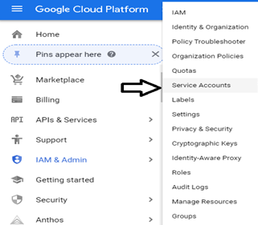

- Click on CREATE SERVICE ACCOUNT

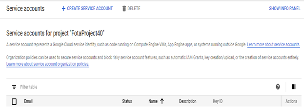

- Add Service account name and Service account description

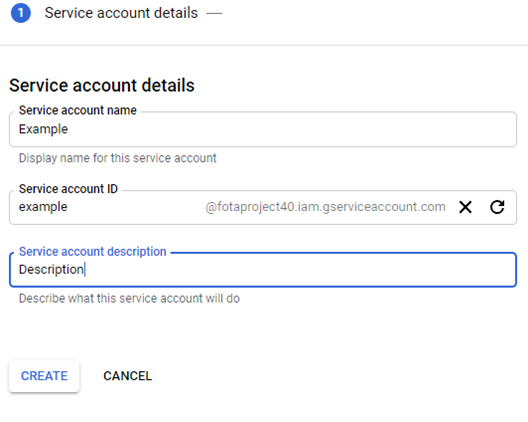

- Select a role for the created Service account

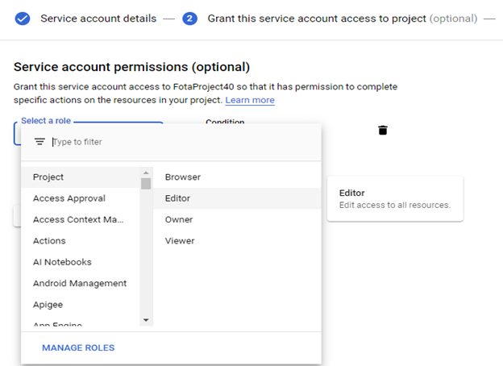

- Grant specific user access to the created service account

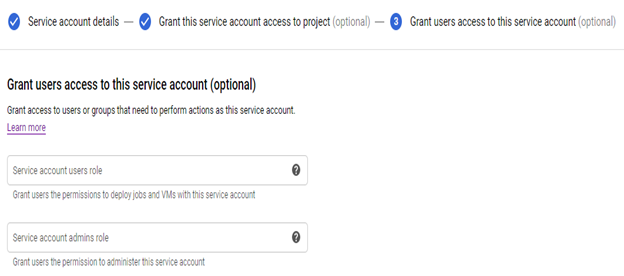

- Generate an authenticated key file through creating a key and press done 

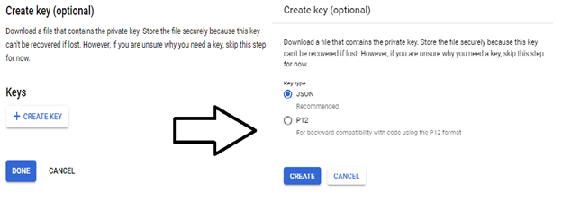

- The generated .JSON key file can be used through VMs for accessing the cloud server that generated this service account key through different APIs, in our project we connected through this key file through Python using google.cloud provided library.

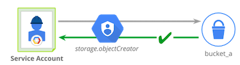

## Serice Account Key Constaints

- If this .Json key file that includes all the credentials is shared through any online platform e.g: Github, Whatsapp , …etc. Google’s support immediately notifies the owner through the registered email address and it can be followed by a suspension to the whole project but it can be reopened be requesting an appeal.

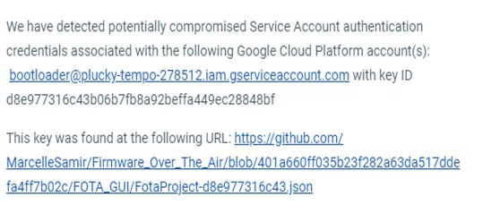

- If you detected any violations from any generated service key account it can be disabled immediately by the owner.

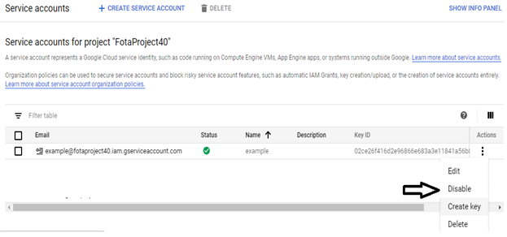

## PC GUI
 
- Python script connected to google cloud to upload .elf file and a text file that announces for a new firmware release

## Raspberry Pi GUI
we're using bash script to generete this GUI by using YAD

- a touch screen is connected to the raspberry Pi as a simulation for Car's dashboard, and we send a notification message to the car on the screen once a new firmware is available and already downloaded to the raspberry Pi

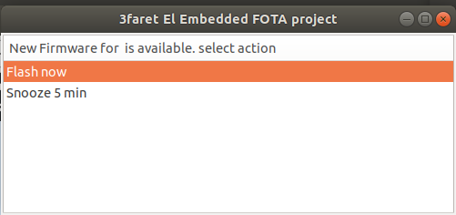

you can try this GUI by 
>yad --title="3faret El Embedded FOTA project" --list --width=500 --height=200 --column "New Firmware for $controller_name is available. select action" 'Flash now' 'Snooze 5 min' --no-buttons --timeout=60using 

- after the flashing of the new firmware is done, we also notify the car on the screen

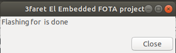

you can also try this by:
>yad --title="3faret El Embedded FOTA project" --text="Flashing for $controller_name is done" --width=350 --height=10 --timeout=5  --dnd

## References

**Connecting to RPI3 - SSH Over Wired**
- https://www.raspberrypi.org/documentation/remote-access/ssh/README.md
- https://www.raspberrypi.org/documentation/configuration/security.md
- https://www.raspberrypi.org/documentation/remote-access/ip-address.md
- https://elinux.org/RPi_Serial_Connection#Console_serial_parameters
- https://pinout.xyz/pinout/uart#

**UART configurations of RaspberryPi**
- https://www.electronicwings.com/raspberry-pi/raspberry-pi-uart-communication-using-python-and-c

**RaspberryPi intenet connection over builtin wifi**
- https://cdn-learn.adafruit.com/downloads/pdf/adafruits-raspberry-pi-lesson-3-network-setup.pdf
- https://www.raspberrypi.org/forums/viewtopic.php?t=139486

**Python on RaspberryPi**
- https://www.raspberrypi.org/documentation/linux/software/python.md 

**google cloud project creation and its sdk for Debian**
- https://cloud.google.com/resource-manager/docs/creating-managing-projects?visit_id=637261915377624130-3117594831&rd=1
- https://cloud.google.com/sdk/docs/quickstart-debian-ubuntu
- https://cloud.google.com/storage/docs/gsutil/commands/cp
- https://cloud.google.com/storage/docs/xml-api/get-bucket-encryption-config?hl=en

**google cloud and python integerarion (Windows)**
- https://riptutorial.com/google-cloud-storage/example/28256/upload-files-using-python
- https://pypi.org/project/google-cloud-storage/

**Raspberry Pi GUI**
- https://bigl.es/tooling-tuesday-auto-start-a-gui-application-in-raspbian/
- http://smokey01.com/yad/
 
**Raspberry Pi touch screen**
- https://trickiknow.com/raspberry-pi-3-complete-tutorial-2018-lets-get-started/
- https://circuitdigest.com/microcontroller-projects/interfacing-3.5-inch-touchscreen-tft-lcd-with-raspberry-pi

**others**
- https://www.raspberrypi.org/documentation/linux/usage/rc-local.md
