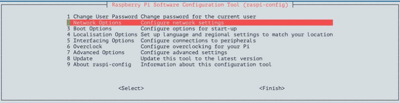
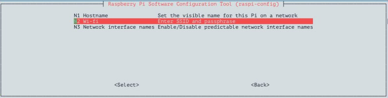
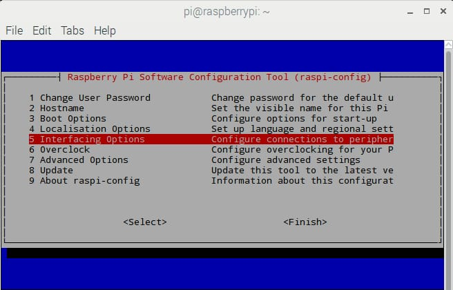
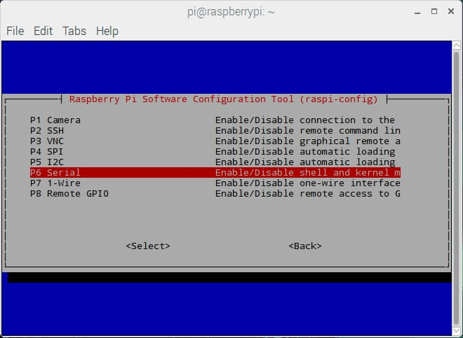
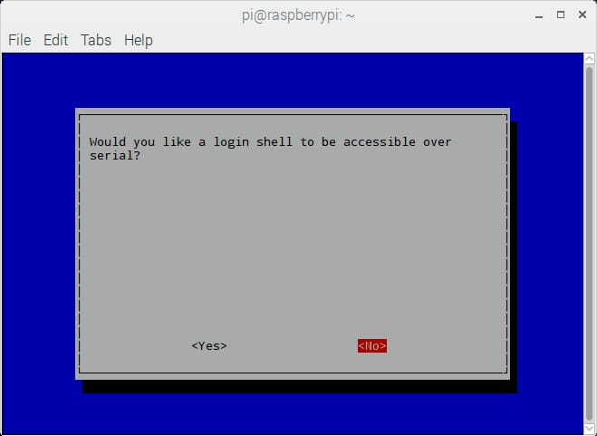
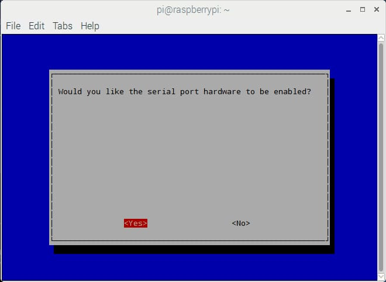
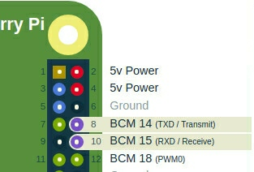
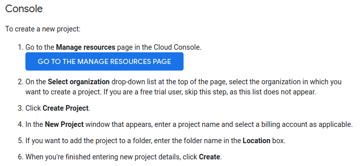

# Firmware_Over_The_Air_RaspberryPi

This project is a firmware over the air for automotive industry using RaspberryPi 3B+ and STm32 Mc 

Till now we are using the full image of raspbian-buster

and also till now we manually put parser.py file and the desired code we want to flash to our st Mc

## The image for RaspberryPi
- you can download the Raspian Image from:
https://www.raspberrypi.org/downloads/raspbian/

- First unzip the the downloaded file using unzip command.
>unzip 2019-09-26-raspbian-buster.zip
- Then insert your SD card into your laptop, To discover the SD card
>lsblk -p   (this name should be /dev/mmcblk0 or /dev/sdX)
- Now time to Copy the unzipped image onto the mounted device using command dd.
>dd bs=4M if=raspbian.img of=/dev/sdX status=progress conv=fsync

## Enable Ethernet connection

To Configure a static IP for RPI3, Modify the file "/etc/network/interfaces" on your Raspbian image (or any Debian image):

Disable the DHCP client for eth0 interface by commenting this line using "#"
>iface eth0 inet dhcp    ====>   #iface eth0 inet dhcp

Add these lines after it to configure eth0 interface to use static IP:

>auto eth0\
>iface eth0 inet static\
>wait-delay 15\
>hostname $(hostname)\
>address 192.168.5.30\
>netmask 255.255.255.0

To enable ssh create an empty file named "ssh" in boot directory
>touch ssh

To enable password authentication, uncomment
>sudo nano /etc/ssh/sshd_config\
>#PasswordAuthentication yes   ====>   PasswordAuthentication yes

To connect with RaspberryPi:
>ssh-keygen -f "/home/$USER/.ssh/known_hosts" -R "192.168.5.30"\
>ssh pi@192.168.5.30 (defualt user: pi, default password: raspberry)

## Enable builtin WIFI
- enter this in terminal to configure wifi
>sudo raspi-config

- then select network

- then select WIFI

- then enter WiFi Name (SSID) and password, now you done with raspi-config.

- then enter this command
>sudo wpa_cli -i wlan0 reconfigure #it will reply with "OK"

## connect to RaspberryPi terminal over WIFI
add those lines to "/etc/network/interfaces"
>auto wlan0\
>iface wlan0 inet static\
>   wait-delay 30\
>   pre-up wpa_supplicant -B -Dwext -iwlan0 -c /etc/wpa_supplicant/wpa_supplicant.conf\
>   post-down killall -q wpa_supplicant\
>   address 192.168.1.30\
>   netmask 255.255.255.0\
>   gateway 192.168.1.1

## Configure UART on RaspberryPi 
>sudo raspi-config

- select -> interfacing options

- then, select serial option to enable UART

- then select No to login shell to be accessible over serial

- then select Yes to enable hardware serial port

- Now our UART is enabled for serial communication on Tx and Rx of RaspberryPi

- add "enable_uart=1" at the end of /boot/config.txt

In PC terminal
- to make sure it is connected and given a port name by the kernel use:
>dmesg  -wH  (ex.  /dev/ttyUSB0 )
- to change its permissions so you can read and write to it:
>sudo chmod o+rw /dev/ttyUSB0
- to test read from (ex. ttyUSB0):
>sudo cat /dev/ttyUSB0
- to test writing to (ex. ttyUSB0) :
>sudo echo "hello" > /dev/ttyUSB0

- connect your TTL(Tx) ==> RaspberryPi(Rx) and then TTL(Rx) ==>  RaspberryPi(Tx), pins (GPIO14 and GPIO15)
and cobbect TTL(GND) to RaspberryPi(GND)

In RaspberryPi terminal
- To check if mini UART (ttyS0) or PL011 UART (ttyAMA0) is mapped to UART pins, enter following commands:
>ls -l /dev
- to test reading from (ttyS0):
>cat /dev/ttyS0
- to test writing to (ttyS0):
>echo "hello" > /dev/ttyS0

You can check the references for further help on how they are created.

## Adding python3 lib
>sudo apt install python3-pyelftools

## google cloud
we are using google cloud to fetch the .elf from,\
sign in to google cloud using gmail account
then create a new project

and then create a new bucket inside this project.

**Adding google cloud sdk for Debian (from Raspberry by terminal):**

- Add the Cloud SDK distribution URI as a package source
>echo "deb [signed-by=/usr/share/keyrings/cloud.google.gpg] http://packages.cloud.google.com/apt cloud-sdk main" | sudo tee -a /etc/apt/sources.list.d/google-cloud-sdk.list

- Import the Google Cloud Platform public key
>curl https://packages.cloud.google.com/apt/doc/apt-key.gpg | sudo apt-key --keyring /usr/share/keyrings/cloud.google.gpg add 

- Update the package list and install the Cloud SDK
>sudo apt-get update && sudo apt-get install google-cloud-sdk

- initialize the connection with google cloud and select the project to work on.
> gcloud init       # you need to run this command @ (root user) to run elf_fetcher.sh at the boot

- to upload a file to google cloud (using Raspberry by terminal)

>gsutil -m cp -R [file name] gs://[Bucket name]/

- to download a file from google cloud (using Raspberry by terminal)

>gsutil -m cp -R gs://[Bucket name]/[file name] <directory to download the file in>

# PC GUI Application

- Adding google cloud compatible python library packages (Windows Cmd)
>pip install google-cloud-datastore
>pip install google-cloud-storage

- Creating Service key account for generating .json file (From cloud.google guides)
>hint: The python script won't connect to the google cloud server throught the json file if the PC time is not right 

- Python script connected to google cloud to upload .elf file and a text file that announces for a new firmware release

## References

**Connecting to RPI3 - SSH Over Wired**
- https://www.raspberrypi.org/documentation/remote-access/ssh/README.md
- https://www.raspberrypi.org/documentation/configuration/security.md
- https://www.raspberrypi.org/documentation/remote-access/ip-address.md
- https://elinux.org/RPi_Serial_Connection#Console_serial_parameters
- https://pinout.xyz/pinout/uart#

**UART configurations of RaspberryPi**
- https://www.electronicwings.com/raspberry-pi/raspberry-pi-uart-communication-using-python-and-c

**RaspberryPi intenet connection over builtin wifi**
- https://cdn-learn.adafruit.com/downloads/pdf/adafruits-raspberry-pi-lesson-3-network-setup.pdf
- https://www.raspberrypi.org/forums/viewtopic.php?t=139486

**Python on RaspberryPi**
- https://www.raspberrypi.org/documentation/linux/software/python.md 

**google cloud project creation and its sdk for Debian**
- https://cloud.google.com/resource-manager/docs/creating-managing-projects?visit_id=637261915377624130-3117594831&rd=1
- https://cloud.google.com/sdk/docs/quickstart-debian-ubuntu
- https://cloud.google.com/storage/docs/gsutil/commands/cp
- https://cloud.google.com/storage/docs/xml-api/get-bucket-encryption-config?hl=en

**google cloud and python integerarion (Windows)**
- https://riptutorial.com/google-cloud-storage/example/28256/upload-files-using-python
- https://pypi.org/project/google-cloud-storage/

**others**
- https://www.raspberrypi.org/documentation/linux/usage/rc-local.md
